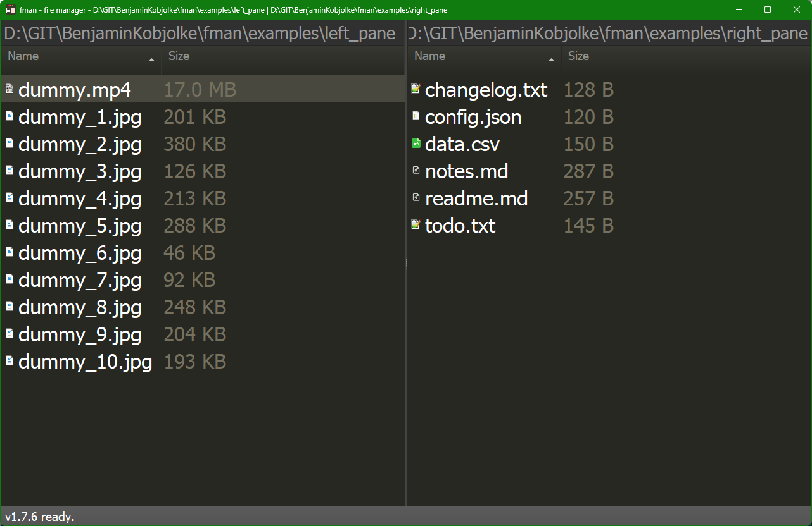
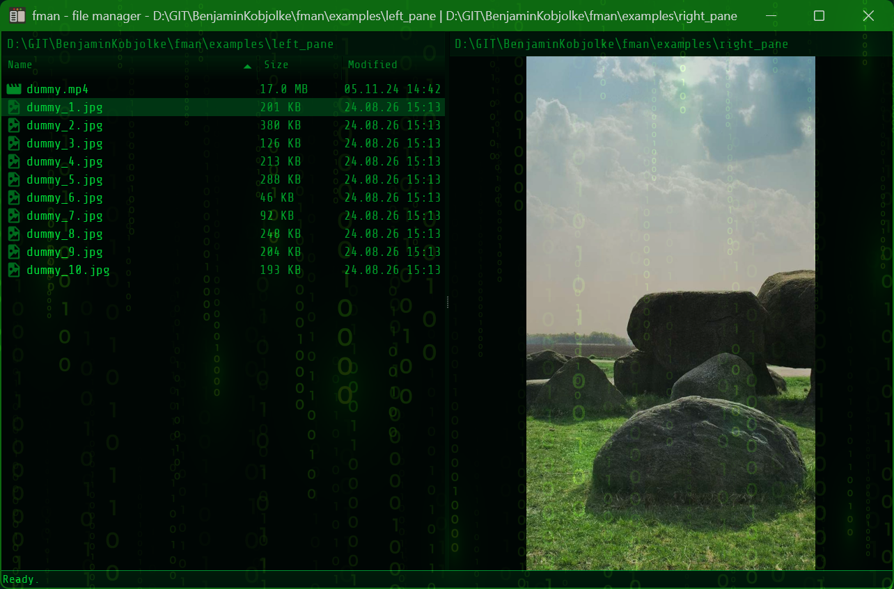
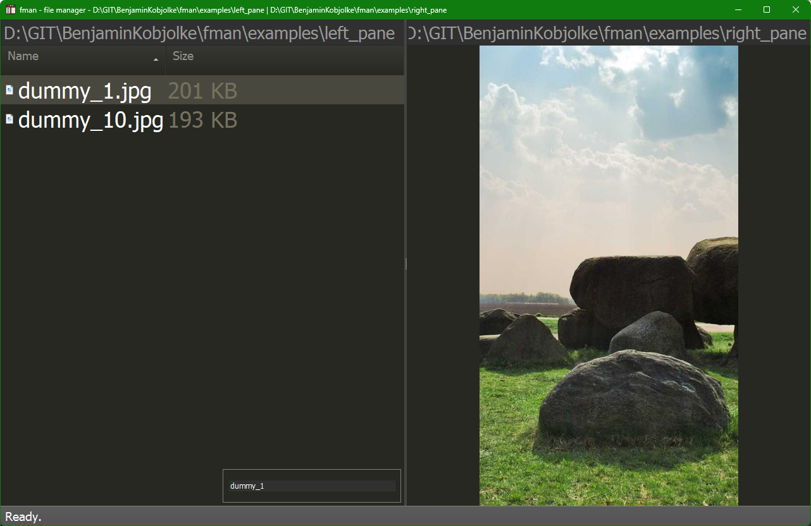
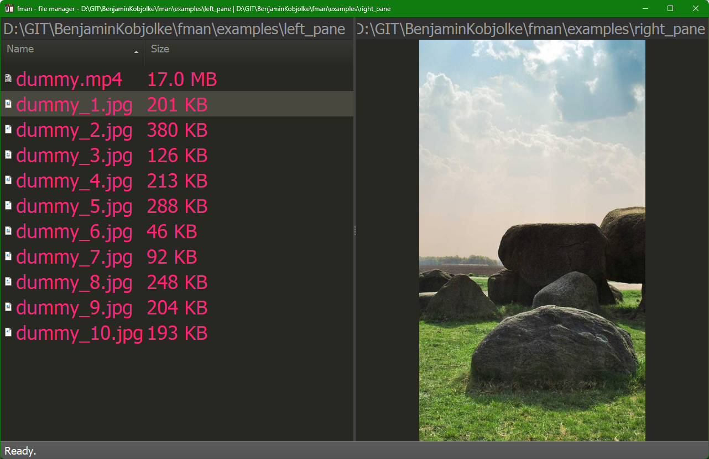
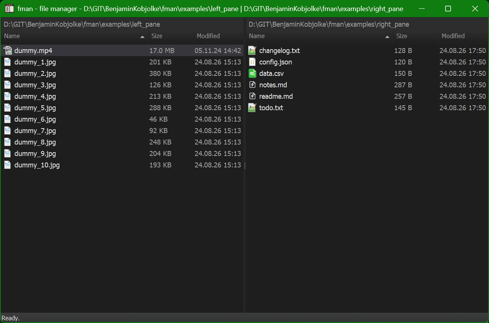

# fman

A cross-platform dual-pane file manager.

## Demo

https://github.com/user-attachments/assets/a2d9524b-1c91-4a82-ad79-29786b0243b4

The tour above, driven from the keyboard, no mouse at any point:

| | |
|---|---|
| Two panes, one keyboard | select with `Ins`/`Ctrl+A`, copy across with `F5`, type to filter, `Ctrl+F1`/`Ctrl+F2` to sort |
| Organize in place | `F7` new folder, `F6` move into it, `Shift+F6` rename |
| Preview inside the pane | images with zoom, text you can edit and save, each viewer with its own command palette |
| Video that actually plays | pause, seek and volume in-pane - and previewing into the *other* pane while you keep browsing |
| Archives are just folders | pack with `Alt+F5`, `Enter` to step inside the zip, `F5` to copy back out |

Full shortcut reference: **[workflow-tools.com/fast-file-manager/help/keybindings](https://workflow-tools.com/fast-file-manager/help/keybindings)**.

More of the UI - the two-pane layout, internal image viewer, inline name
filter, and command palette (`Ctrl+Shift+P`):

| Panes | Internal viewer | Filter | Select all |
|---|---|---|---|
|  |  |  |  |

## Themes

## Documentation

More on individual features in [docs/](docs/):

| Doc | Topic |
|---|---|
| [ARCHIVES.md](docs/ARCHIVES.md) | `.zip`, `.7z`, `.tar` browsed like folders, backed by a bundled `7za` |
| [COMMAND_PALLETTE.md](docs/COMMAND_PALLETTE.md) | The `Ctrl+Shift+P` palette |
| [DEMOS.md](docs/DEMOS.md) | How the demo recordings are made |
| [KEYBINDINGS.md](docs/KEYBINDINGS.md) | Default key bindings |
| [SINGLE_INSTANCE.md](docs/SINGLE_INSTANCE.md) | Reusing a running window, and the `single_instance` setting |
| [THEMES.md](docs/THEMES.md) | Theme files and switching |
| [WINDOWS_NETWORK_SUPPORT.md](docs/WINDOWS_NETWORK_SUPPORT.md) | UNC paths, network drive icons |
| [WINDOW_TITLE.md](docs/WINDOW_TITLE.md) | Window title format |
| [PURCHASING.md](docs/PURCHASING.md) | License / purchasing |
| [CREATE_NEW_RELEASE.md](docs/CREATE_NEW_RELEASE.md) | Release process |

## Web help system

A searchable, mobile-friendly reference of all keyboard shortcuts is online at
**[workflow-tools.com/fast-file-manager/help](https://workflow-tools.com/fast-file-manager/help/)**.

It is generated by its own repo,
[fman-web-help-system](https://github.com/BenjaminKobjolke/fman-web-help-system),
which regenerates its data from this repo's source; point its `fman_repo_dir`
config at a local fman checkout.

## Plugins

fman plugins maintained on this account:

| Plugin | What it does |
|---|---|
| [fman-xd-plugins](https://github.com/BenjaminKobjolke/fman-xd-plugins) | Grab bag: copy paths to clipboard, a cross-folder file list for batch copy/move, duplicate, create symlink. |
| [FMANEverythingSearch-Windows](https://github.com/BenjaminKobjolke/FMANEverythingSearch-Windows) | Search files with Everything (voidtools). Windows only. |
| [FuzzySearchFilesInCurrentFolder](https://github.com/BenjaminKobjolke/FuzzySearchFilesInCurrentFolder) | Fuzzy-locate files and folders below the current directory. |
| [fman-search-window-2022](https://github.com/BenjaminKobjolke/fman-search-window-2022) | File search with the results in their own window. |
| [FMAN-FilterByDate](https://github.com/BenjaminKobjolke/FMAN-FilterByDate) | Filter the current directory down to files from today or the last X days. |
| [FManPowerRenamerAndReplacer](https://github.com/BenjaminKobjolke/FManPowerRenamerAndReplacer) | Rename many files at once via search and replace. |
| [FManDuplicateFilesAndIncrementExtension](https://github.com/BenjaminKobjolke/FManDuplicateFilesAndIncrementExtension) | `Ctrl+D` duplicates the selected file and bumps its index (`NAME_0001.ext`). |
| [FManSyncSelectedFilesToOtherPaneForWindows](https://github.com/BenjaminKobjolke/FManSyncSelectedFilesToOtherPaneForWindows) | Sync the selected files to the other pane using robocopy. Windows only. |
| [fman-favorites-windows](https://github.com/BenjaminKobjolke/fman-favorites-windows) | Favorite directories, shareable across machines through placeholder paths. |
| [FMAN_FTPClient](https://github.com/BenjaminKobjolke/FMAN_FTPClient) | Browse FTP servers as a filesystem (ftputil). |
| [FmanSevenZipTools](https://github.com/BenjaminKobjolke/FmanSevenZipTools) | 7-Zip archive commands (fork of alphaniner's, with the debug features that broke on other machines removed). |
| [ProcessFS](https://github.com/BenjaminKobjolke/ProcessFS) | Browse and kill running processes via the `Show processes` command. |
| [TortoiseGit4Fman](https://github.com/BenjaminKobjolke/TortoiseGit4Fman) | Run TortoiseGit commands on the current file or folder. Windows only. |
| [FMANGoWezTerm](https://github.com/BenjaminKobjolke/FMANGoWezTerm) | Open WezTerm in the current directory. |
| [FMANGoConemu](https://github.com/BenjaminKobjolke/FMANGoConemu) | Open ConEmu in the current directory (`Alt+Shift+C`), and map the current network path to a drive letter. |
| [FMANLaunchScriptsForWindows](https://github.com/BenjaminKobjolke/FMANLaunchScriptsForWindows) | Launch scripts from a configured scripts directory. |
| [FManSharexExtension](https://github.com/BenjaminKobjolke/FManSharexExtension) | Send the selected file to ShareX. Windows only. |
| [FmanSaveAsDialogExtension](https://github.com/BenjaminKobjolke/FmanSaveAsDialogExtension) | Use fman's last-used directories inside the Windows Save-As dialog. Windows only. |

## Development instructions

fman currently uses Python 3.14.

Install the requirements for your operating system. For example:

    pip install -Ur requirements/mac.txt       # macOS
    pip install -Ur requirements/ubuntu.txt    # Ubuntu/Debian
    pip install -Ur requirements/arch.txt      # Arch Linux
    pip install -Ur requirements/fedora.txt    # Fedora
    pip install -Ur requirements/windows.txt   # Windows

Then you can use `python build.py` to run, compile etc. fman. For example:

    python build.py run

Call `python build.py` without arguments to see a list of available commands.
This uses [fman build system](https://build-system.fman.io/).

You can run automated tests with `python build.py test`. On Windows, this
requires Developer Mode (Settings -> System -> Advanced) to be enabled, or some
tests related to symlinks will fail.
