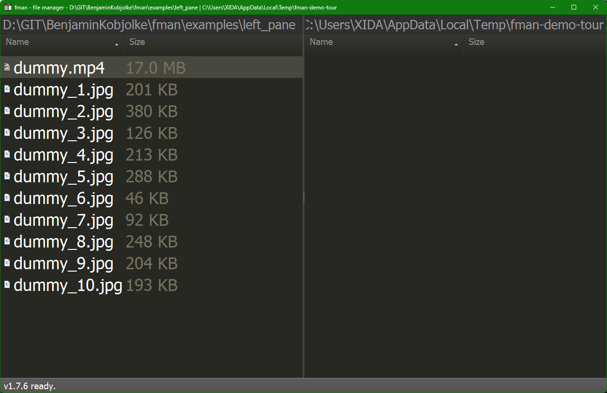

# fman

A cross-platform dual-pane file manager.

## Demo

Select all, copy across panes, and play a video in the internal viewer — all
from the keyboard. Also available as [MP4](media/demos/tour/demo.mp4).

More of the UI — the two-pane layout, internal image viewer, inline name
filter, and command palette (`Ctrl+Shift+P`):

| Panes | Internal viewer | Filter | Select all |
|---|---|---|---|
|  |  |  |  |

Regenerate with `tools\demos_record.bat` — see [docs/DEMOS.md](docs/DEMOS.md).

## Single instance

fman runs as a single instance by default: launching it with a path while it is
already running opens that folder in the active pane of the existing window
instead of spawning a new one. See [docs/single_instance.md](docs/single_instance.md)
for details and the `single_instance` setting to disable it.

## Windows network drives

UNC paths (`\\server\share`, RDP-redirected drives like `\\tsclient\C\...`)
no longer freeze the window: the hidden-file filter reads fman's cached `stat`
instead of doing its own blocking call on the GUI thread, the background loader
stops retrying files it cannot load, and files on a share get one generic icon
per extension rather than a per-file Windows shell lookup. See
[docs/WINDOWS_NETWORK_SUPPORT.md](docs/WINDOWS_NETWORK_SUPPORT.md) for the
`Toggle network drive icons` command that restores real icons.

## Web help system

A searchable, mobile-friendly reference of all keyboard shortcuts lives in its own
repo: [fman-web-help-system](https://github.com/BenjaminKobjolke/fman-web-help-system).
It regenerates its data from this repo's source; point its `fman_repo_dir` config at
a local fman checkout.

## Development instructions

fman currently uses Python 3.14.

Install the requirements for your operating system. For example:

    pip install -Ur requirements/mac.txt       # macOS
    pip install -Ur requirements/ubuntu.txt    # Ubuntu/Debian
    pip install -Ur requirements/arch.txt      # Arch Linux
    pip install -Ur requirements/fedora.txt    # Fedora
    pip install -Ur requirements/windows.txt   # Windows

Then you can use `python build.py` to run, compile etc. fman. For example:

    python build.py run

Call `python build.py` without arguments to see a list of available commands.
This uses [fman build system](https://build-system.fman.io/).

You can run automated tests with `python build.py test`. On Windows, this
requires Developer Mode (Settings -> System -> Advanced) to be enabled, or some
tests related to symlinks will fail.
