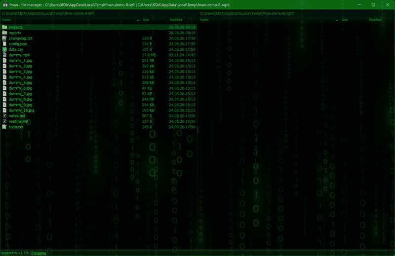
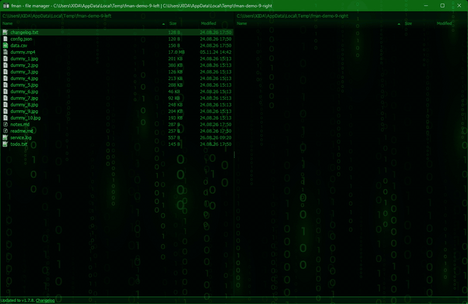
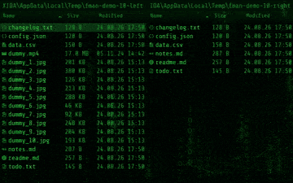

# fman

**A file manager you drive entirely from the keyboard.**

Preview text, images and video *inside* the pane. Step into a `.zip` like it's
a folder. Run any command from a fuzzy palette. Extend it in Python.

### [⬇ Download for Windows](https://github.com/BenjaminKobjolke/fman/releases/latest)

v1.7.8 · signed installer, 75 MB · no license key, no trial, no nag screen

*macOS and Linux: fman runs on both — [build from source](#build-from-source).*

## See it work

https://github.com/user-attachments/assets/a2d9524b-1c91-4a82-ad79-29786b0243b4

The whole tour is driven from the keyboard. The mouse is never touched.

| | |
|---|---|
| Two panes, one keyboard | select with `Ins`/`Ctrl+A`, copy across with `F5`, type to filter, `Ctrl+F1`/`Ctrl+F2` to sort |
| Organize in place | `F7` new folder, `F6` move into it, `Shift+F6` rename |
| Preview inside the pane | images with zoom, text you can edit and save, each viewer with its own command palette |
| Video that actually plays | pause, seek and volume in-pane - and previewing into the *other* pane while you keep browsing |
| Archives are just folders | pack with `Alt+F5`, `Enter` to step inside the zip, `F5` to copy back out |

| Panes | Internal viewer | Filter | Select all |
|---|---|---|---|
|  |  |  |  |

## What you get

**Navigate.** `Ctrl+P` jumps to any folder by fuzzy name, with tab-completion
and your visited paths ranked first. `Alt+←`/`Alt+→` walk your history.
`Alt+F1`/`Alt+F2` list drives, `Ctrl+\` goes to the drive root,
`Ctrl+→`/`Ctrl+←` push a folder into the other pane. Panes update themselves
when files change on disk. → [KEYBINDINGS.md](docs/KEYBINDINGS.md)

**Move files.** `F5` copy and `F6` move across panes, with progress, conflict
prompts and cancel. `F7` new folder, `Shift+F6` rename, `Shift+F5` symlink.
`F8` goes to the recycle bin, `Shift+Del` doesn't. Explorer's clipboard works
(`Ctrl+C`/`X`/`V`), so does drag & drop. `F11` copies paths, `Ctrl+.` toggles
hidden files, and *Compare directories* selects whatever the other pane is
missing.

**Preview without leaving.** Text, image and video viewers open *in the pane*,
not in another app. Each has its own command palette and its own rebindable
keys, and you can step to the next file without going back to the list. Text
opens read-only, switches to editable, and saves — with **tail mode that
follows a growing log**. Images zoom; video seeks and remembers its volume.
→ [FILE_VIEWERS.md](docs/viewers/FILE_VIEWERS.md)

**Archives are folders.** `.zip`, `.7z` and `.tar` open with `Enter`, and you
copy in and out of them like any directory. A bundled `7za` ships for Windows,
macOS and Linux — nothing to install. On Windows this is **~6× faster than it
was**, with a progress bar that actually moves: a 62 MB, 992-file zip went from
9.8 s to 1.7 s. → [ARCHIVES.md](docs/ARCHIVES.md)

**Make it yours.** 11 bundled themes, switched live from the palette, no
restart. Your own theme is one small JSON file of colors; fonts and padding
live in a `Theme.css` override file. Plus window transparency, pane font zoom
(`Alt+↑`/`Alt+↓`), toggleable columns, single-pane mode, and every key
rebindable.
→ [THEMES.md](docs/THEMES.md) · [COMMAND_PALLETTE.md](docs/COMMAND_PALLETTE.md)

**Extend it in Python.** Plugins add commands, columns, listeners — even whole
filesystems, which is how FTP and process browsing work below. Install one
**from inside fman**: it searches GitHub and loads the plugin without a
restart. → [Plugins](#plugins)

**Fits your desktop.** Opening a folder from Explorer or the command line
reuses the window you already have. On Windows, network shares stay responsive
instead of freezing the UI. Release notes are translated into 40 languages and
readable in-app. → [SINGLE_INSTANCE.md](docs/SINGLE_INSTANCE.md) ·
[WINDOWS_NETWORK_SUPPORT.md](docs/WINDOWS_NETWORK_SUPPORT.md)

Full shortcut reference:
**[workflow-tools.com/fast-file-manager/help/keybindings](https://workflow-tools.com/fast-file-manager/help/keybindings)**

## Themes

Eleven bundled themes — Monokai, Dark, Light, Solarized Dark/Light, Nord,
Dracula, Gruvbox Dark, High Contrast, WezTerm, Matrix. Run *Select theme* from
the command palette; it applies immediately, no restart.

Writing your own is one JSON file listing only the colors you want to change.
Fonts, padding and one-off color pins go in a user `Theme.css` that loads last
and wins over every theme — see [THEMES.md](docs/THEMES.md).

## Plugins

fman is extensible in Python, and installs plugins **from inside the app**: run
*Install plugin* from the command palette and it searches GitHub, downloads and
hot-loads it. Plugins can add commands, columns, context-menu entries and
entire filesystems.

These are the ones maintained on this account. The **Demo** column fills in as
clips get recorded — see [DEMOS_PLUGINS.md](docs/DEMOS_PLUGINS.md):

| Plugin | What it does | Demo |
|---|---|---|
| [FMAN-MatrixRain](https://github.com/BenjaminKobjolke/FMAN-MatrixRain) | The film's digital rain inside a pane, in your theme's colours. One pane, both panes, or as an idle screensaver. |  |
| [fman-xd-plugins](https://github.com/BenjaminKobjolke/fman-xd-plugins) | Grab bag: copy paths to clipboard, a cross-folder file list for batch copy/move, duplicate, create symlink. |  |
| [FMANEverythingSearch-Windows](https://github.com/BenjaminKobjolke/FMANEverythingSearch-Windows) | Search files with Everything (voidtools). Windows only. |  |
| [FuzzySearchFilesInCurrentFolder](https://github.com/BenjaminKobjolke/FuzzySearchFilesInCurrentFolder) | Fuzzy-locate files and folders below the current directory. |  |
| [fman-search-window-2022](https://github.com/BenjaminKobjolke/fman-search-window-2022) | File search with the results in their own window. |  |
| [FMAN-FilterByDate](https://github.com/BenjaminKobjolke/FMAN-FilterByDate) | Filter the current directory down to files from today or the last X days. |  |
| [FManPowerRenamerAndReplacer](https://github.com/BenjaminKobjolke/FManPowerRenamerAndReplacer) | Rename many files at once via search and replace. |  |
| [FManDuplicateFilesAndIncrementExtension](https://github.com/BenjaminKobjolke/FManDuplicateFilesAndIncrementExtension) | `Ctrl+D` duplicates the selected file and bumps its index (`NAME_0001.ext`). |  |
| [FManSyncSelectedFilesToOtherPaneForWindows](https://github.com/BenjaminKobjolke/FManSyncSelectedFilesToOtherPaneForWindows) | Sync the selected files to the other pane using robocopy. Windows only. |  |
| [fman-favorites-windows](https://github.com/BenjaminKobjolke/fman-favorites-windows) | Favorite directories, shareable across machines through placeholder paths. |  |
| [FMAN_FTPClient](https://github.com/BenjaminKobjolke/FMAN_FTPClient) | Browse FTP servers as a filesystem (ftputil). |  |
| [FmanSevenZipTools](https://github.com/BenjaminKobjolke/FmanSevenZipTools) | 7-Zip archive commands (fork of alphaniner's, with the debug features that broke on other machines removed). |  |
| [ProcessFS](https://github.com/BenjaminKobjolke/ProcessFS) | Browse and kill running processes via the `Show processes` command. |  |
| [TortoiseGit4Fman](https://github.com/BenjaminKobjolke/TortoiseGit4Fman) | Run TortoiseGit commands on the current file or folder. Windows only. |  |
| [FMANGoWezTerm](https://github.com/BenjaminKobjolke/FMANGoWezTerm) | Open WezTerm in the current directory. |  |
| [FMANGoConemu](https://github.com/BenjaminKobjolke/FMANGoConemu) | Open ConEmu in the current directory (`Alt+Shift+C`), and map the current network path to a drive letter. |  |
| [FMANLaunchScriptsForWindows](https://github.com/BenjaminKobjolke/FMANLaunchScriptsForWindows) | Launch scripts from a configured scripts directory. |  |
| [FManSharexExtension](https://github.com/BenjaminKobjolke/FManSharexExtension) | Send the selected file to ShareX. Windows only. |  |
| [FmanSaveAsDialogExtension](https://github.com/BenjaminKobjolke/FmanSaveAsDialogExtension) | Use fman's last-used directories inside the Windows Save-As dialog. Windows only. |  |

## Documentation

| Doc | Topic |
|---|---|
| [ARCHIVES.md](docs/ARCHIVES.md) | `.zip`, `.7z`, `.tar` browsed like folders, backed by a bundled `7za` |
| [COMMAND_PALLETTE.md](docs/COMMAND_PALLETTE.md) | The `Ctrl+Shift+P` palette |
| [COMMAND_PALETTE_KEYWORDS.md](docs/COMMAND_PALETTE_KEYWORDS.md) | Hidden search keywords, and editing them with `Shift+Enter` |
| [DEMOS.md](docs/DEMOS.md) | How the demo recordings are made |
| [DEMOS_PLUGINS.md](docs/DEMOS_PLUGINS.md) | Recording a demo of a third-party plugin |
| [FONTS.md](docs/FONTS.md) | The bundled font families, picking one, adding your own |
| [ICONS.md](docs/ICONS.md) | File icon sets, icon size, writing your own |
| [KEYBINDINGS.md](docs/KEYBINDINGS.md) | Default key bindings |
| [PLUGINS.md](docs/PLUGINS.md) | Installing, reloading and removing plugins; duplicate package names |
| [PLUGINS_API.md](docs/PLUGINS_API.md) | Writing a plugin: layout, registration, panes, viewers |
| [STATUSBAR.md](docs/STATUSBAR.md) | The bar at the bottom: what it says, hiding it, theming it |
| [SINGLE_INSTANCE.md](docs/SINGLE_INSTANCE.md) | Reusing a running window, and the `single_instance` setting |
| [THEMES.md](docs/THEMES.md) | Theme files, color tokens and switching |
| [TUTORIAL.md](docs/TUTORIAL.md) | The onboarding tour: where its bubble sits, who owns the keyboard, writing a step |
| [WINDOWS_NETWORK_SUPPORT.md](docs/WINDOWS_NETWORK_SUPPORT.md) | UNC paths, network drive icons |
| [WINDOW_FUNCTIONS.md](docs/WINDOW_FUNCTIONS.md) | Window-level functions: chrome toggles, opacity, the dim behind dialogs, centering |
| [WINDOW_TITLE_AND_BARS.md](docs/WINDOW_TITLE_AND_BARS.md) | Window title format, hiding the title bar (and, on macOS, the Help menu) |
| [PURCHASING.md](docs/PURCHASING.md) | Why there is nothing to buy |
| [CREATE_NEW_RELEASE.md](docs/CREATE_NEW_RELEASE.md) | Release process |

A searchable, mobile-friendly reference of all keyboard shortcuts is online at
**[workflow-tools.com/fast-file-manager/help](https://workflow-tools.com/fast-file-manager/help/)**.
It is generated by its own repo,
[fman-web-help-system](https://github.com/BenjaminKobjolke/fman-web-help-system),
which regenerates its data from this repo's source; point its `fman_repo_dir`
config at a local fman checkout.

## Build from source

Needed on macOS and Linux, and for developing fman itself. fman currently uses
Python 3.14.

Install the requirements for your operating system:

    pip install -Ur requirements/mac.txt       # macOS
    pip install -Ur requirements/ubuntu.txt    # Ubuntu/Debian
    pip install -Ur requirements/arch.txt      # Arch Linux
    pip install -Ur requirements/fedora.txt    # Fedora
    pip install -Ur requirements/windows.txt   # Windows

Then run it:

    python build.py run

Call `python build.py` without arguments to see a list of available commands.
This uses the [fman build system](https://build-system.fman.io/).

The video viewer needs the native `libmpv` library. On Windows fman downloads
it on first use; on macOS install it with `brew install mpv`, on Debian/Ubuntu
with `apt install libmpv2`.

Run the automated tests with `python build.py test`. On Windows this requires
Developer Mode (Settings -> System -> Advanced) to be enabled, or some tests
related to symlinks will fail.

## License

MIT — see [LICENSE](LICENSE).

Upstream fman is commercial software. This fork **removed** that machinery
rather than disabling it: the license validator, the nag screen, the
`NOT REGISTERED` title marker and the licensee-email telemetry ping are all
deleted. Every installation is fully activated, and nothing phones home. See
[PURCHASING.md](docs/PURCHASING.md).
